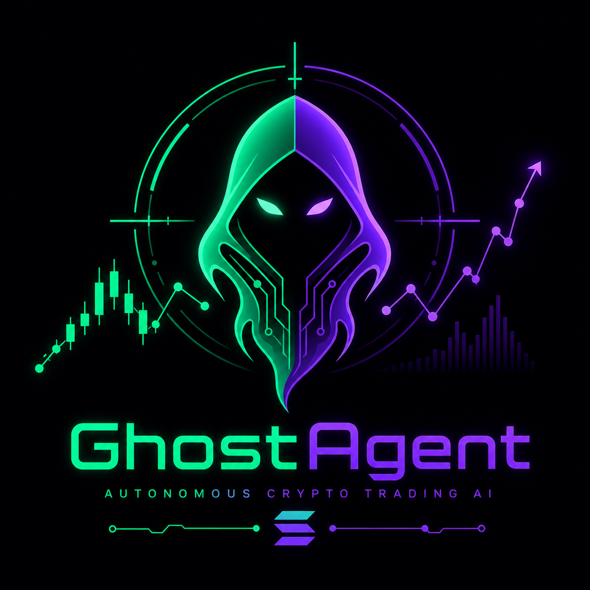

<div align="center">
  
  <h1>👻 GhostAgent Protocol x $GHOST Token</h1>
  <p><strong>Autonomous HFT Engine with Community Fee-Sharing on Solana</strong></p>
  <p><i>Submission for The BAGS Hackathon - 2026</i></p>
</div>

---

## 🌌 Vision

Retail traders in DeFi are systematically destroyed by institutional HFT bots, toxic flow, and front-running. **GhostAgent Protocol** is the counter-measure: a fully autonomous, sub-second HFT scalping engine on Solana — now powered by a community ownership layer via **$GHOST token** and The Bags ecosystem.

**The Ghost doesn't just trade for you. It trades *with* you.**

---

## 🪙 $GHOST Token: Real Utility, Not Hype

| Mechanism | Description |
| :--- | :--- |
| **Hold-to-Use (The Gate)** | Minimum 10,000 $GHOST required in wallet to activate the bot and access the live PnL dashboard. |
| **Fee-Sharing (Buy-Back & Burn)** | 5% of net HFT profits are used to auto-buy $GHOST on Raydium. 50% burned (deflationary), 50% distributed to Bags LPs. |
| **Bags API Integration** | Holder verification, fee distribution, and token burn status are all visible live from the Web UI dashboard. |

---

## ✨ Key Technical Features

- ⚡ **Sub-Second Execution:** Built for Solana's low-latency environment. RSI, ADX, Bollinger Bands, MACD overlays.
- 🛡️ **3-Tier HFT Risk Management:** From low-spread momentum breakouts to aggressive Ghost fading strategies.
- 🕸️ **TTP Ghost Engine:** Trailing Take-Profit across multiple Solana liquidity pools for micro-profit locking.
- 🧠 **Vibe Coding Architecture:** Entire system built via Human + AI Director methodology (Claude + Obsidian Second Brain).
- 🎛️ **Cyberpunk Web UI:** Real-time PnL, $GHOST token panel (burn status, holder count, fee pool), and emergency extract.

---

## 🏗️ Architecture

```text
bot.py                → Async event loop & Agent Brain (HFT Core)
strategy_router.py    → Signal generation & multi-timeframe engine
risk_manager.py       → Position sizing, DCA layers, P&L tracking
exchanges/            → Solana Network adapters (Pacifica Protocol Mock)
web_ui.py             → Flask Dashboard + /api/ghost/status endpoint
templates/index.html  → Live UI: PnL Panel + $GHOST Token Panel
```

---

## 🚀 Quick Start

```bash
pip install flask flask-cors pandas
python web_ui.py
```

Navigate to `http://127.0.0.1:5566` — The $GHOST Token Panel is live on the dashboard.

---
<div align="center">
  <i>Built with ❤️ for The BAGS Hackathon | Powered by Solana & $GHOST</i>
</div>
